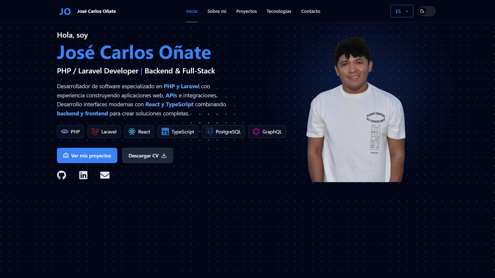
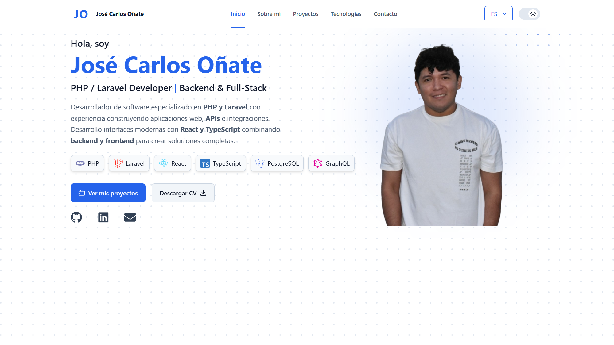

# Portfolio — José Carlos Oñate

[](https://react.dev/)
[](https://www.typescriptlang.org/)
[](https://vite.dev/)
[](https://tailwindcss.com/)

Portfolio personal desarrollado para presentar mi perfil profesional, proyectos, experiencia y tecnologías como desarrollador de software, con especial enfoque en backend con PHP y Laravel.

**Sitio en producción:** [www.josecarlosonate.com](https://www.josecarlosonate.com)

## Vista previa

### Dark



### Light



## Características

- Diseño responsive para escritorio, tablet y móvil.
- Temas claro y oscuro.
- Contenido disponible en español e inglés.
- Secciones de presentación, experiencia, proyectos, tecnologías y contacto.
- Galería interactiva para presentar los proyectos destacados.
- Formulario de contacto conectado a una función serverless y Resend.
- Metadatos Open Graph y Twitter para compartir el sitio.
- Configuración SEO básica con canonical, robots.txt y sitemap.xml.
- Despliegue continuo en Vercel desde la rama `main`.

## Tecnologías

### Frontend

- React 19
- TypeScript
- Tailwind CSS 4
- Vite
- GSAP
- Embla Carousel
- Lucide React
- React Icons
- Sonner

### Servicios e infraestructura

- Vercel
- Resend
- Cloudflare

## Desarrollo local

### Requisitos

- Node.js
- npm

### Instalación

```bash
git clone https://github.com/josecarlosonate/Portafolio.git
cd Portafolio
npm install
```

Inicia el servidor de desarrollo:

```bash
npm run dev
```

Para generar el build de producción:

```bash
npm run build
```

## Variables de entorno

El formulario de contacto utiliza Resend. Para ejecutarlo con la integración de correo se requiere:

```env
RESEND_API_KEY=your_resend_api_key
```

No expongas esta clave en el cliente ni la incluyas en el repositorio.

## Producción

La rama `main` corresponde a producción y se despliega mediante Vercel.

**URL pública:** [https://www.josecarlosonate.com](https://www.josecarlosonate.com)

---

Desarrollado por **José Carlos Oñate**.
